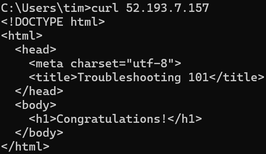
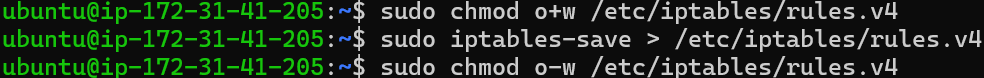

# 個人作業6：troubleshooting lab 的驗屍報告

## 題目

https://lightda-tw.notion.site/20241107-W09-6-1282ceabc70c802789ecf9d6147c31aa

## 找到的問題

### 問題一：有服務挾持了 80 port

1. 經由老師提供的機器建立資訊建立新的機器後，首先，我們先透過`curl localhost`查看目前看到的問題：

2. 首先想到的是：`curl localhost`使用的是 port 80，因此先用`sudo lsof -i -P -n | grep LISTEN`查看是哪個程式使用了 port 80：

3. 透過 htop，我找到了`/usr/local/bin/.lab/srv`，並在 kill 掉後，確實就無法打到 port 80 了。

### 問題二：NGINX 的設定檔錯誤

4. 同時，題目中提到我們有管理了一個 NGINX web server，但我發現到 nginx 並沒有在執行中。然而，嘗試使用`sudo systemctl start nginx`啟動時，失敗了。
透過`journalctl -xeu nginx.service`看到錯誤是因為`unexpected ";" in /etc/nginx/nginx.conf:8`

5. 然而，更有趣的事情發生了！由於檔案系統已滿，刪除多餘的分號的設定檔並無法儲存。因此我透過移除`/var/lib/apt/lists`釋放空間並重新寫入，然後重新啟動 nginx 服務。

### 問題三：專案的 HTML 檔案權限有誤

6. 接著，透過觀察`/etc/nginx/nginx.conf`，我循線找到了`/etc/nginx/sites-enabled/default`，並且找到了有關在 80 port listen 的部分以及專案的`root /var/myweb`了。然而，`curl localhost`依然失敗。

7. 我在nginx的設定檔裡面看到了`error_log /var/log/myweb/error.log`;，並看到了原來是`index.html`檔案的權限設太小了，導致身為`www-data`使用者的`nginx`無法存取。因此我透過`sudo chmod a+r /var/myweb/index.html`修正此問題。

### 問題四：防火牆阻擋了請求

8. 然而，經過這些操作後，`curl localhost`依然失敗，並且在`nginx`的`error.log`與`/var/log/myweb/error.log`中都沒有新的紀錄，更不用說要尋找錯誤訊息。因此，我將方向轉到了防火牆上。

9. 透過`sudo iptables -L`，我看到防火牆阻擋了所有的 tcp 請求：

10. 透過`sudo iptables -D INPUT -p tcp --dport 80 -j REJECT --reject-with icmp-port-unreachable`，我刪除了該阻擋規則。至此，我們可以正確取得 HTML 內容了！
  
並且在本機也可以正確取得內容：  
 

### 問題五：systemd 與防火牆的設定並沒有被持久保存

11. 然而，重開機後，fake server 又出現了！想到 nginx 是透過 systemd 管理的，會不會 fake server 也是透過 systemd 管理的？  
透過`systemctl status`，沒想到還真的看到了`srv.service`，並且路徑就是`/usr/local/bin/.lab/srv`。  
因此，我關閉了`srv`並開啟了`nginx`，並且再次嘗試`curl localhost`與重新開機，此次已成功解決。

12. 再次設定`sudo iptables -D INPUT -p tcp --dport 80 -j REJECT --reject-with icmp-port-unreachable`開啟防火牆後，我透過`sudo iptables-save > /etc/iptables/rules.v4`儲存防火牆的設定。

## 額外任務：解決硬碟空間被吃滿的問題

13. 現在而言，我們的檔案系統的狀況如下：

14. 於是，我嘗試尋找超大的檔案
 

15. 就是他們！在刪除這4個檔案後，我們的系統空間終於恢復了。

## 心得

以前我從來沒有從一個壞掉的系統中找問題的經驗，遇到問題時要不是是自己的電腦、自己知道自己做過什麼事，要不然就是有 Git log 可以查看之前做過什麼事，有著許多的蛛絲馬跡可以查詢。

我很享受這次僅有極少的提示的情況下，特別是我旁聽的身份並沒有組員可以互相協助，仍需要找到這些答案的過程。一個系統內有太多可能會影響我們的元件需要考慮，但是我以前都沒有考慮過。有這樣的機會學習真的太酷了！
